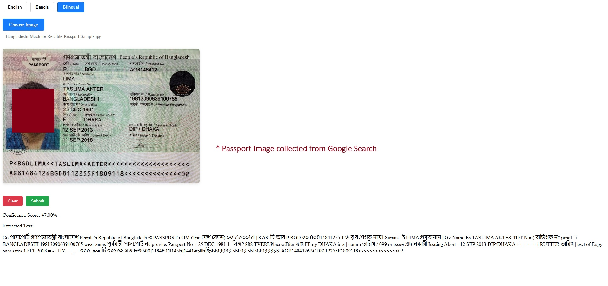
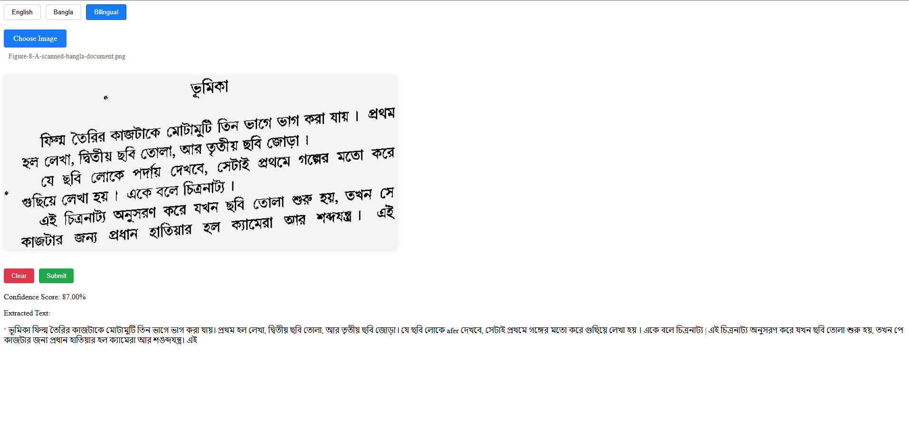

# Multi-Language OCR Application

A React-based Optical Character Recognition (OCR) application that supports both English and Bangla text extraction from images. Built using Tesseract.js, this application can process images containing text in English, Bangla, or both languages simultaneously.

## Features

- Support for English and Bangla text recognition
- Bilingual mode for mixed language content
- Real-time processing progress indicator
- Confidence score display
- Image preview before processing
- Clean and intuitive user interface

## Accuracy Notes

Tesseract OCR's accuracy varies depending on several factors:

- Image quality (resolution, contrast, lighting)
- Text clarity and font type
- Language complexity

In testing, Tesseract.js typically achieves:
- English text: 85-95% accuracy with clear images
- Bangla text: 75-85% accuracy with clear images
- Mixed language: 70-80% accuracy

For best results:
- Use clear, well-lit images
- Ensure text has good contrast with background
- Avoid skewed or rotated text
- Use high-resolution images

## Sample Results

### Sample 1: Passport Data

*Sample passport image showing bilingual text recognition capabilities*

### Sample 2: Bangla Text

*Sample Bangla text document demonstrating native language processing*

*Note: All sample images used in this documentation are collected from Google Images and are used for demonstration purposes only.*

## Technologies Used

- React + Vite
- Tesseract.js
- CSS3 for styling

## Getting Started

1. Clone the repository
2. Install dependencies:
```bash
npm install

npm run dev

## Author
en-arnob